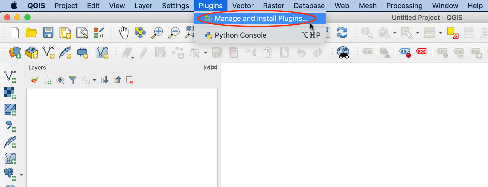
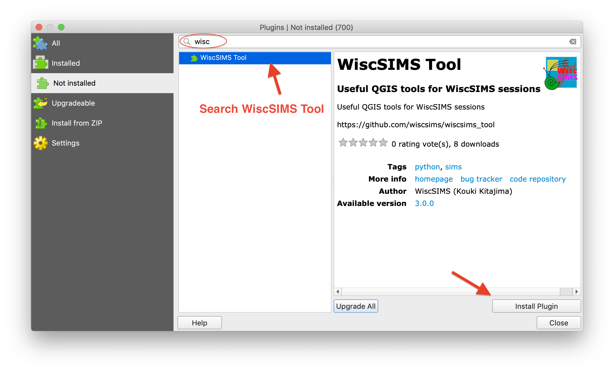

# WiscSIMS Tool

A QGIS3 plugin for external/internal WiscSIMS users.

## Table of Contents

<!-- START doctoc generated TOC please keep comment here to allow auto update -->
<!-- DON'T EDIT THIS SECTION, INSTEAD RE-RUN doctoc TO UPDATE -->

- [Features](#features)
- [Requirements](#requirements)
  - [QGIS3](#qgis3)
- [Installation](#installation)
  - [Install from QGIS Plugin Repository (Recommended)](#install-from-qgis-plugin-repository-recommended)
  - [Install from ZIP file](#install-from-zip-file)
- [Usage](#usage)
  - [Import Data](#import-data)
  - [Preset (pre-select SIMS spots on QGIS maps)](#preset-pre-select-sims-spots-on-qgis-maps)
    - [Comments](#comments)
    - [Layer](#layer)
    - [Scale](#scale)
    - [Preset Mode](#preset-mode)
    - [Undo](#undo)
    - [Modify spot locations](#modify-spot-locations)
    - [Modify comment](#modify-comment)

<!-- END doctoc generated TOC please keep comment here to allow auto update -->

## Features

WiscSIMS Tool has two features.

1. Importing Excel spreadsheets into QGIS maps.
2. Pre-selecting (preset) SIMS spots on QGIS maps.

## Requirements

### [QGIS3](https://www.qgis.org/)
QGIS3 (>3.10) is recommended.
  - [MacOS](https://qgis.org/downloads/macos/qgis-macos-ltr.dmg)
  - [Windows](https://qgis.org/downloads/QGIS-OSGeo4W-3.10.8-1-Setup-x86_64.exe) (64 bit)
  - [Windows](https://qgis.org/downloads/QGIS-OSGeo4W-3.10.8-1-Setup-x86.exe) (32 bit)

## Installation
There are two ways to install `WiscSIMS Tool`.

### Install from QGIS Plugin Repository (Recommended)

1. Open QGIS.

2. From the QGIS menu, select `Plugins` > `Manege and Install Plugins`.

3. Search/find `WiscSIMS Tool` from the plugin list and click `Install Plugin` button on the right bottom of `Manege and Install Plugins` window.

4. Select `Installed Plugins` to make sure `WiscSIMS Tool` was correctlly installed. If it is not checked, click the checkbox (on the left of green puzzle piece icon) to activate the plugin. You also see `WiscSIMS Tool` icon in the QGIS toolbar.

### Install from ZIP file
Manual installation is also available.
1. Download `WiscSIMS Tool`  (**wiscsims_tool.zip**) from [WiscSIMS GitHub repository](https://github.com/wiscsims/wiscsims_tool/releases/latest/download/wiscsims_tool.zip).

2. Open QGIS.

3.  From the QGIS menu, select `Plugins` > `Manege and Install Plugins`.

1. Select `Intall from ZIP` and hit `...` button to select downloaded `wiscsims_tool.zip` file.

1. Hit `Install Plugin` to install `WiscSIMS Tool`.
2. Select `Installed Plugins` to make sure `WiscSIMS Tool` was correctlly installed. You also see `WiscSIMS Tool` icon in the QGIS toolbar.

## Usage

Activate **`WiscSIMS Tool`** from toolbar or menu `plugins` > `WiscSIMS` > `WiscSIMS Tool`.

### Import Data

_To be updated_

### Preset (pre-select SIMS spots on QGIS maps)

You can select spots for SIMS analysis with three selecting modes: Point, Line and Grid. All or part of selected spots can be exported to Excel file (WiscSIMS session file) for manual/automated analysis.

#### Comments

You can set comment as you want. Comments are saved with preset point into selected layer. `{}` in the comment will be replaced by incremented numbers. Incremented numbers can be formatted using Python's [Format Specification Mini-Language](https://docs.python.org/2.7/library/string.html#format-specification-mini-language). For example, {:04} (four characters padded with zeros) will be formatted as '0001'.

#### Layer

Layers for preset must be vector layer and have a column/field named `Comment` (first letter should be capital). You can use pre-existing layers or create a new layer for preset spots. Hit refresh button when you added layer for preset manually to update layer list.

#### Scale

You can define the scale of image as a `Pixel Size`. In WiscSIMS Tool, pixel size has unit of **`µm/map_unit`**. If you have `aligment file (.json)` used in your WiscSIMS session and loaded in `Import` panel, `Pixel Size` will be automatically updated.
If you don't know the pixel size of the image, you can use **1 µm** for now. If the spot size displayed is too large or too small, adjust the pixel size appropriately. This scale will be used to preset spots in WiscSIMS Tool.

#### Preset Mode

There are three types of preset mode, Point, Line and Grid in WiscSIMS Tool. You can change those three modes with tabs in Preset Mode section in Preset panel.

- **Point Mode**

  In Point Mode, SIMS spots are added by clicking on your sample images on a QGIS map. If you want to change the comment for each spot, the "pop up comment box" option is helpful. A small window will appear right after you click on it and you can edit your comment.

- **Line**

  In Line Mode, you can add spots along the line defined by two spots. At first, you can select a start-point of line by left click, then select a end-point by right click. You will see previews of red spots and comments in gray square ballon. Note that red circles only show positions of the spots to be added, circle size is not to scale. Secondly, you can modify step size or number of spots as you want. Preview will be updated automatically with your modification. Finally, hit `Add Points` button at the bottom of `Preset Mode` section to addf points to the selected layer.

- **Grid**

  In Grid Mode, you can add spots as a grid (m x n). Left click defines the first spot of the grid. Preview will show up as well as `Line Mode`. You can modify step sizes and number of spots for vertical and horizontal. You can also choose analysis order in the grid from two options (`Vertical, then Horizontal` or `Horizontal, then Vertical`). Thin red line in the preview indicates chosen analysis order. After hit `Add Points`, poins are stored in the selected layer.

#### Undo

Undo for added point(s) is avaiable when `Undo` button is active. Currently, a maximum of 100 undo is possible.

#### Modify spot locations

Locations of preset spots can be modified by click, drag & drop with **`shift`** key. 

TODO: [movie]

#### Modify comment

Comments for each spot can be modified later. Click the spot with pressing `Alt(Windows)/Option(MacOS)`, then small popup window shows for editing original comment.

TODO: [movie]

